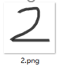
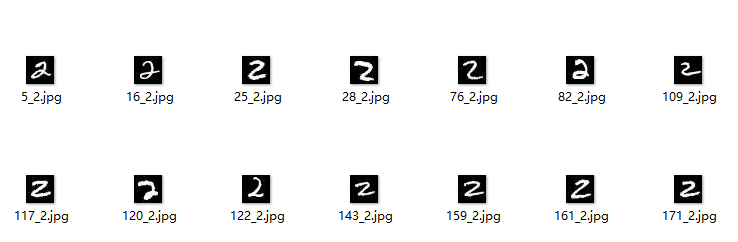

# Image-database-search-algorithm-based-on-Neural-Network
Using the classic MNIST data set to build the image database, the search algorithm uses neural network, and uses the digital 0-9 image drawn by oneself as the new image to retrieve the similar images in the image database, and copies all the similar images in the image database to similar_ IMG folder for users to check.

# Installation Dependencies:
- python3
- tensorflow2
- pygame
- numpy


# How to use?
## train
run with following command:  
```python mnist_train.py```
## application
run with following command:  
```python mnist_app.py```

# Visualization
give the handwriting picture to find number 2 in dataset in following picture  
## handwriting(2)

## find in dataset
